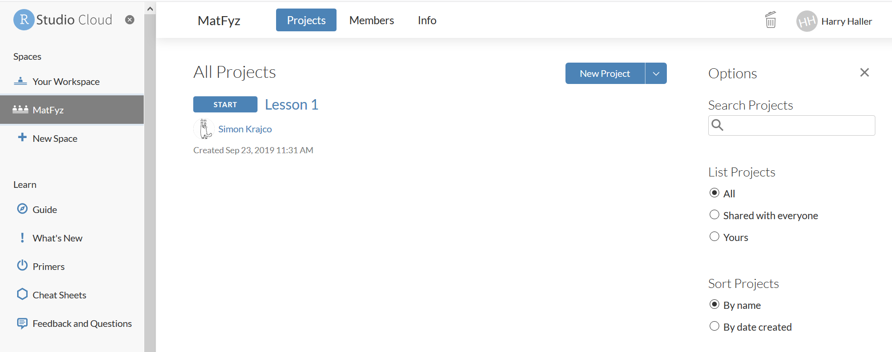
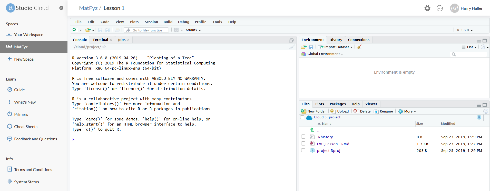
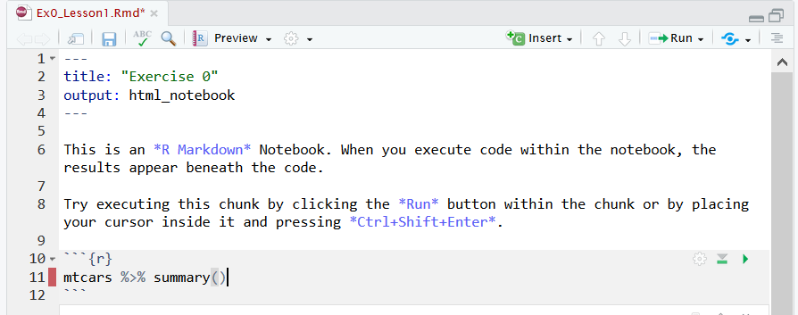
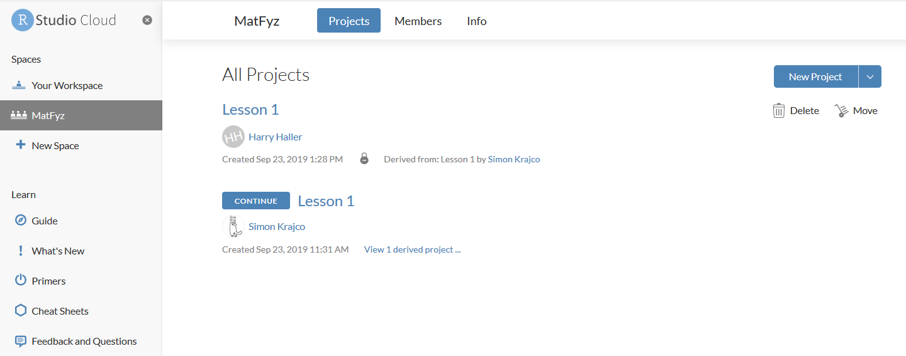

# RStudio Cloud - How to Use

#### First steps
When you log in, you should open the 'MatFyz' workspace. This is the environment we will use for our lessons. There, you should see the first project we will work with.
There will be more projects available. Actually, a new project will be released prior to each lesson.

#### Working with a project
After choosing an appropriate project, you get into the RStudio environment. This is cloud version of the normal (desktop) RStudio version you are possibly familiar with. 
You can create files (scripts, notebooks, ...), upload data, save the results. But first, select the 'Ex0_Lesson1.Rmd' file and take a look.

#### How to use HTML notebook
Follow the steps in the file. Mind that the html notebook is not the same as a basic R script!

#### What if I screw up your carefully created materials?
You won't. When you open a project, your local copy of all the files is created. We are able to see the changes you made (great for checking your homeworks!) to your copy, but you are not able to change the files we uploaded. In case you accidentally deleted / overwrote some file and you would like to start from scratch, go back to the workspace.

You should now see the original version of the project, and your local copy. If you delete your local copy and open the original version again, a new copy will be created.
